# BitShield_Clone - Flow Charts Chi Tiết

## Tổng Quan Dự Án

BitShield là một dự án nghiên cứu bảo vệ chống lại các cuộc tấn công bit-flip trên các file thực thi mạng nơ-ron sâu (DNN). Dự án cung cấp hai chế độ sử dụng:
- **Chế độ đơn giản**: Không cần Docker, chỉ cần Python và Git
- **Chế độ đầy đủ**: Với Docker để có tất cả tính năng

---

## 1. Flow Chart Tổng Quan Dự Án

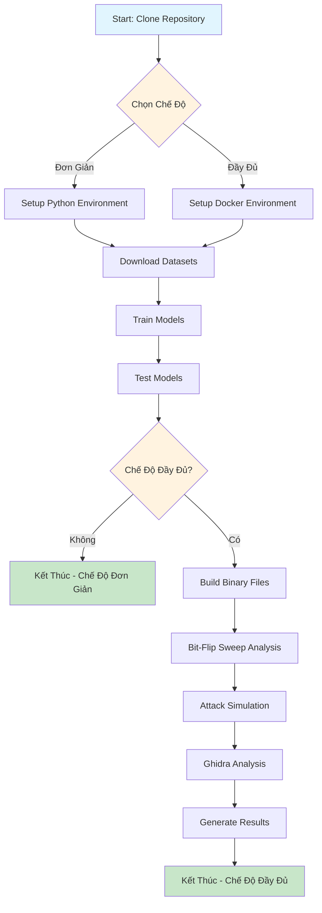

---

## 2. Flow Chart Cài Đặt và Setup

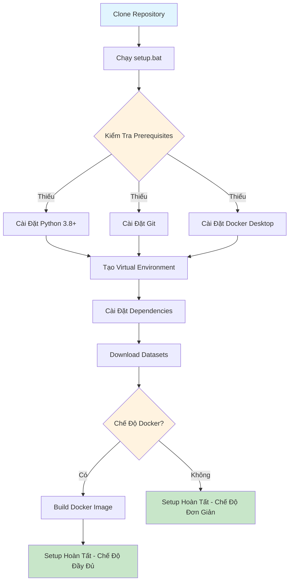

---

## 3. Flow Chart Huấn Luyện Mô Hình

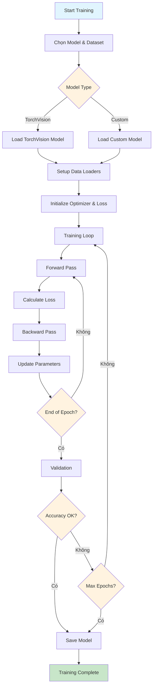

---

## 4. Flow Chart Build Binary Files

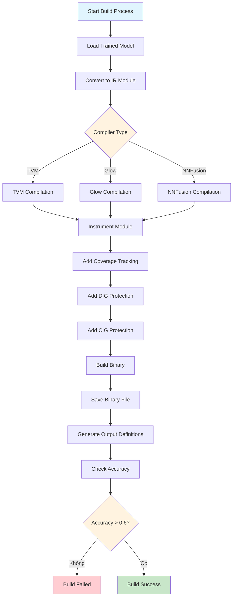

---

## 5. Flow Chart Bit-Flip Sweep Analysis

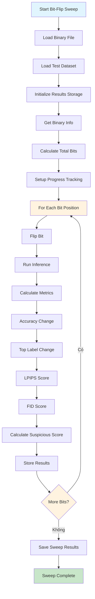

---

## 6. Flow Chart Attack Simulation

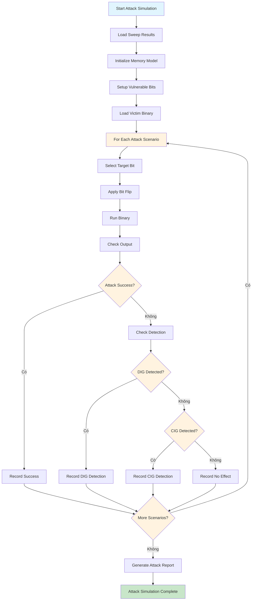

---

## 7. Flow Chart Ghidra Analysis

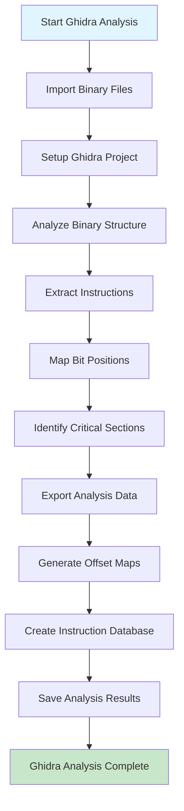

---

## 8. Flow Chart Complete Workflow

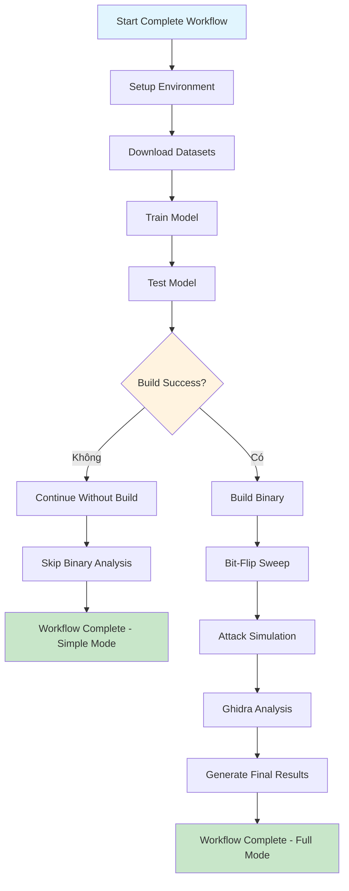

---

## 9. Flow Chart Data Management

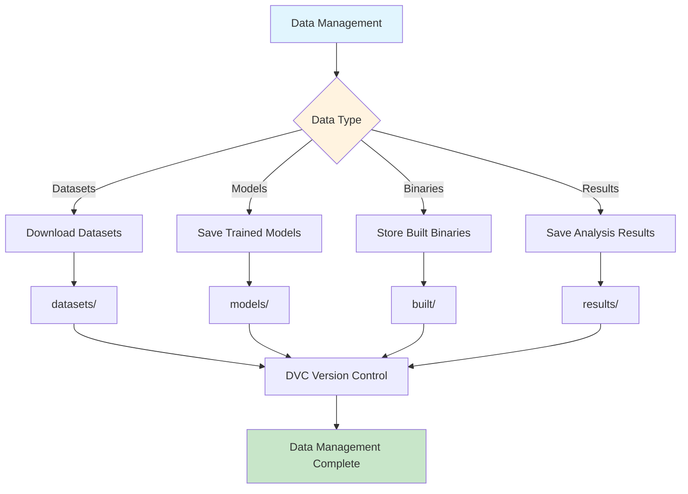

---

## 10. Flow Chart Error Handling

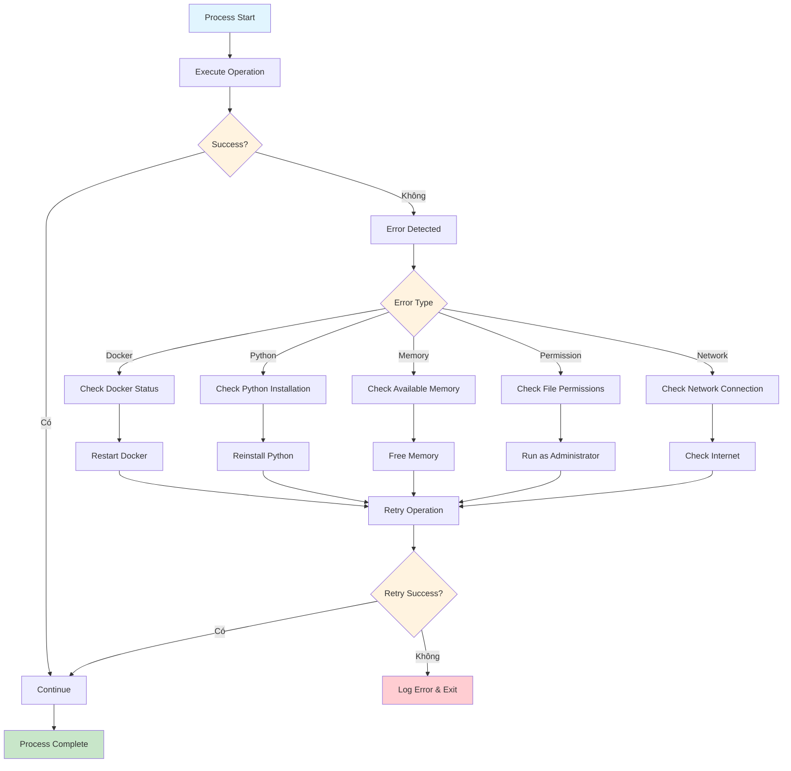

---

## 11. Flow Chart Model Configuration

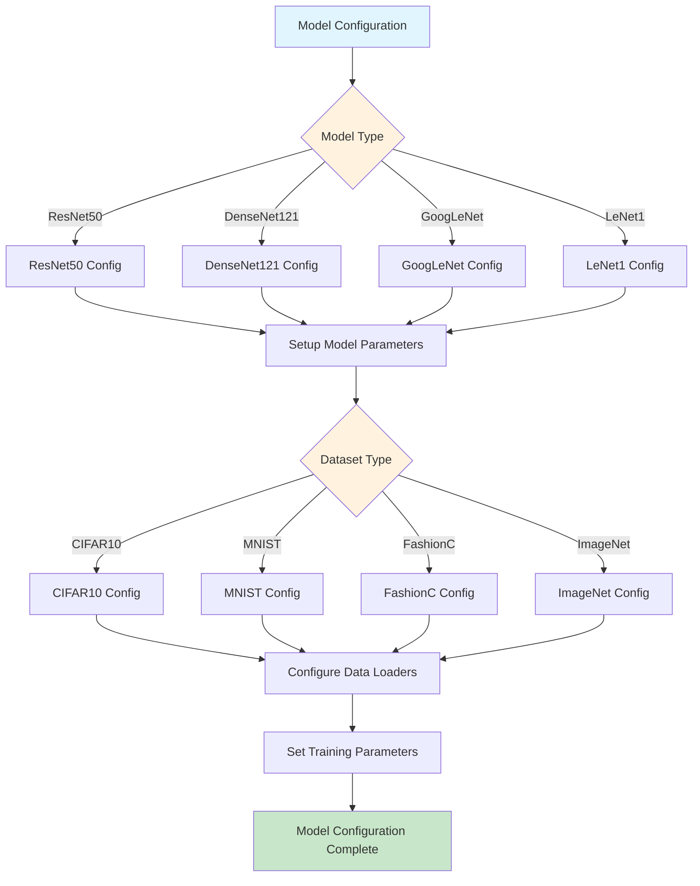

---

## 12. Flow Chart Protection Mechanisms

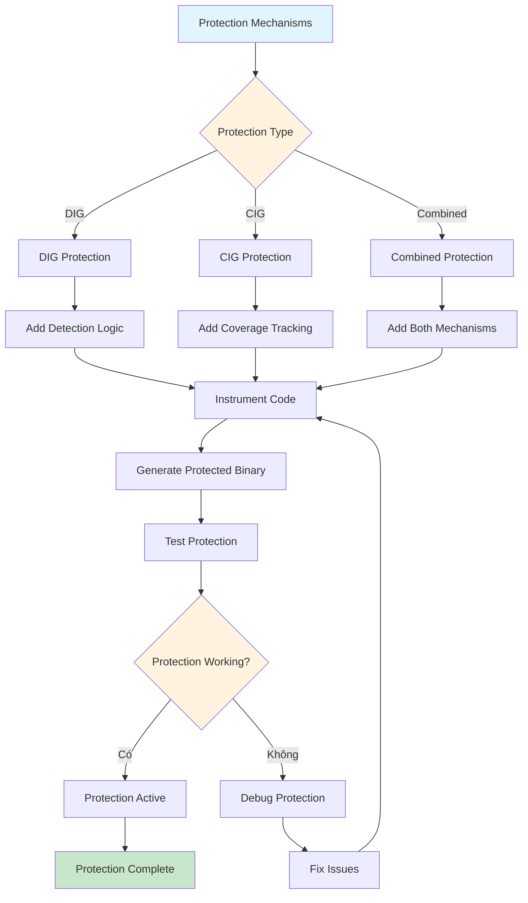

---

## 13. Flow Chart Logic Mã Nguồn - BinaryInfo Class

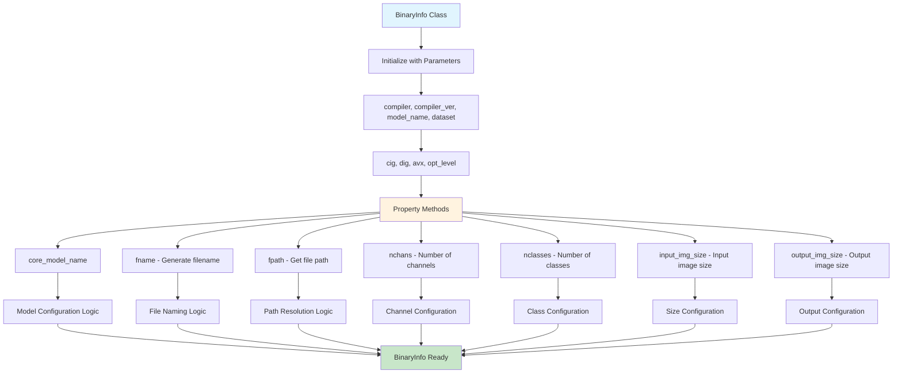

---

## 14. Flow Chart Logic Mã Nguồn - Data Management

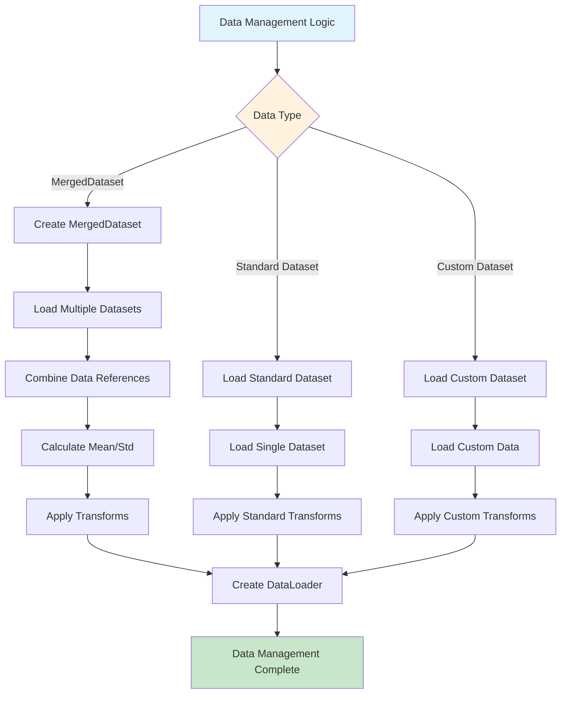

---

## 15. Flow Chart Logic Mã Nguồn - CIG Protection

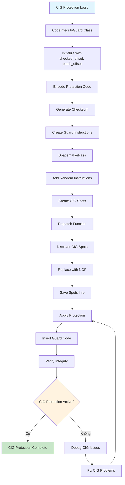

---

## 16. Flow Chart Logic Mã Nguồn - Instrumentation

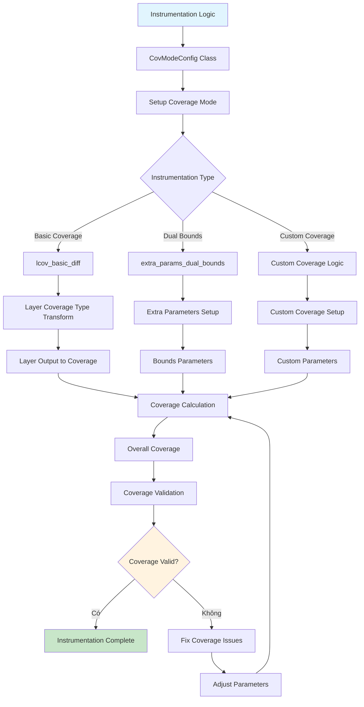

---

## 17. Flow Chart Logic Mã Nguồn - Bit Flip Utilities

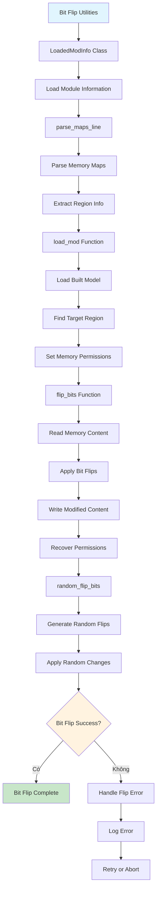

---

## 18. Flow Chart Logic Mã Nguồn - Model Building Process

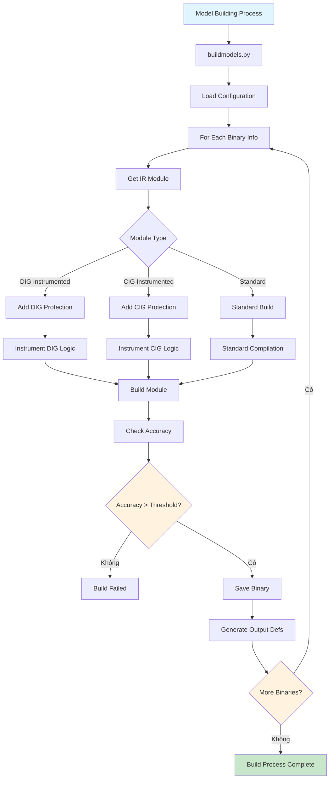

---

## 19. Flow Chart Logic Mã Nguồn - Sweep Analysis Process

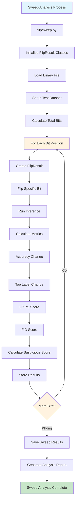

---

## 20. Flow Chart Logic Mã Nguồn - Attack Simulation Process

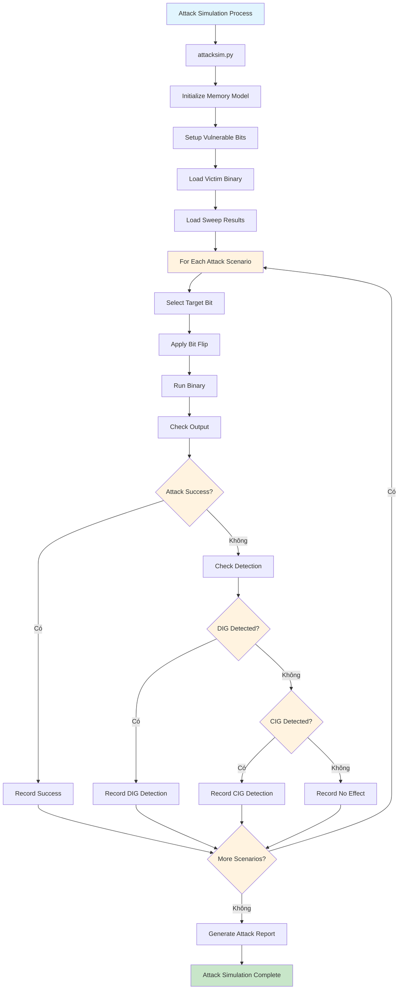

---

## Tóm Tắt Các Thành Phần Chính

### 1. **Core Components**
- **Training Module**: Huấn luyện các mô hình DNN
- **Build Module**: Chuyển đổi mô hình thành binary files
- **Sweep Module**: Phân tích bit-flip vulnerabilities
- **Attack Module**: Mô phỏng tấn công
- **Analysis Module**: Phân tích binary với Ghidra

### 2. **Protection Mechanisms**
- **DIG (Detection of Integrity Guard)**: Phát hiện thay đổi integrity
- **CIG (Coverage Integrity Guard)**: Theo dõi coverage để phát hiện anomalies

### 3. **Supported Models**
- ResNet50, DenseNet121, GoogLeNet, LeNet1
- CIFAR10, MNIST, FashionC, ImageNet datasets

### 4. **Compilers**
- TVM, Glow, NNFusion

### 5. **Workflow Modes**
- **Simple Mode**: Chỉ training và testing
- **Full Mode**: Toàn bộ pipeline từ training đến attack simulation

### 6. **Key Classes và Functions**
- **BinaryInfo**: Quản lý thông tin binary files
- **MergedDataset**: Xử lý datasets phức tạp
- **CodeIntegrityGuard**: Triển khai CIG protection
- **CovModeConfig**: Cấu hình coverage modes
- **LoadedModInfo**: Quản lý loaded modules
- **FlipResult**: Lưu trữ kết quả bit-flip

### 7. **Core Processes**
- **Model Building**: Chuyển đổi PyTorch models thành binaries
- **Instrumentation**: Thêm protection mechanisms
- **Bit-Flip Sweep**: Phân tích vulnerabilities
- **Attack Simulation**: Mô phỏng tấn công thực tế
- **Memory Management**: Quản lý memory permissions và bit manipulation

Các flow chart này cung cấp cái nhìn tổng quan chi tiết về cách dự án BitShield hoạt động, từ cài đặt ban đầu đến việc thực hiện các thí nghiệm bảo mật phức tạp, bao gồm cả logic mã nguồn chi tiết của từng thành phần.
