# BitShield_Clone - Flow Charts

## Tổng Quan Dự Án

BitShield là một dự án nghiên cứu bảo vệ chống lại các cuộc tấn công bit-flip trên các file thực thi mạng nơ-ron sâu (DNN). Dự án cung cấp hai chế độ sử dụng:
- **Chế độ đơn giản**: Không cần Docker, chỉ cần Python và Git
- **Chế độ đầy đủ**: Với Docker để có tất cả tính năng

---

## 1. Flow Chart Tổng Quan Dự Án - Chi Tiết

```mermaid
graph TD
    A[🚀 Start: Clone Repository<br/>git clone BitShield_Clone] --> B{🎯 Chọn Chế Độ Sử Dụng}
    
    B -->|📦 Đơn Giản| C[🐍 Setup Python Environment<br/>• Python 3.8+<br/>• Virtual Environment<br/>• Install Dependencies]
    B -->|🐳 Đầy Đủ| D[🐳 Setup Docker Environment<br/>• Docker Desktop<br/>• Build Docker Image<br/>• Configure Container]
    
    C --> E[📥 Download Datasets<br/>• CIFAR10, MNIST<br/>• FashionC, ImageNet<br/>• Auto-download & Setup]
    D --> E
    
    E --> F[🎓 Train Models<br/>• Load Model Architecture<br/>• Setup Data Loaders<br/>• Training Loop<br/>• Save Checkpoints]
    F --> G[🧪 Test Models<br/>• Load Trained Model<br/>• Evaluate on Test Set<br/>• Calculate Metrics<br/>• Generate Reports]
    
    G --> H{🔍 Chế Độ Đầy Đủ?}
    H -->|❌ Không| I[✅ Kết Thúc - Chế Độ Đơn Giản<br/>• Models Trained<br/>• Basic Testing Done<br/>• Ready for Deployment]
    H -->|✅ Có| J[🔨 Build Binary Files<br/>• Convert PyTorch to IR<br/>• TVM/Glow/NNFusion Compilation<br/>• Add Protection Mechanisms]
    
    J --> K[🔍 Bit-Flip Sweep Analysis<br/>• Load Binary File<br/>• Test Each Bit Position<br/>• Calculate Vulnerability Scores<br/>• Store Results]
    K --> L[⚔️ Attack Simulation<br/>• Setup Memory Model<br/>• Simulate Bit Flips<br/>• Test Protection Mechanisms<br/>• Record Attack Results]
    L --> M[🔬 Ghidra Analysis<br/>• Import Binary Files<br/>• Static Code Analysis<br/>• Extract Instructions<br/>• Generate Reports]
    M --> N[📊 Generate Results<br/>• Compile Analysis Data<br/>• Create Visualizations<br/>• Generate Reports<br/>• Export Results]
    N --> O[🏆 Kết Thúc - Chế Độ Đầy Đủ<br/>• Complete Security Analysis<br/>• Protection Evaluation<br/>• Research Results Ready]
    
    style A fill:#e3f2fd,stroke:#1976d2,stroke-width:3px
    style I fill:#c8e6c9,stroke:#388e3c,stroke-width:2px
    style O fill:#c8e6c9,stroke:#388e3c,stroke-width:2px
    style B fill:#fff3e0,stroke:#f57c00,stroke-width:2px
    style H fill:#fff3e0,stroke:#f57c00,stroke-width:2px
    style C fill:#e8f5e8,stroke:#4caf50,stroke-width:2px
    style D fill:#e3f2fd,stroke:#2196f3,stroke-width:2px
    style F fill:#fff8e1,stroke:#ff9800,stroke-width:2px
    style G fill:#fff8e1,stroke:#ff9800,stroke-width:2px
    style J fill:#f3e5f5,stroke:#9c27b0,stroke-width:2px
    style K fill:#e0f2f1,stroke:#009688,stroke-width:2px
    style L fill:#ffebee,stroke:#f44336,stroke-width:2px
    style M fill:#e8eaf6,stroke:#3f51b5,stroke-width:2px
    style N fill:#f1f8e9,stroke:#8bc34a,stroke-width:2px
```



---

## 2. Flow Chart Cài Đặt và Setup - Chi Tiết

```mermaid
graph TD
    A[📥 Clone Repository<br/>git clone &lt;repo-url&gt;] --> B[⚙️ Chạy setup.bat<br/>• Check System Requirements<br/>• Setup Environment Variables<br/>• Initialize Project Structure]
    B --> C{🔍 Kiểm Tra Prerequisites<br/>• Python Version<br/>• Git Installation<br/>• Docker Status<br/>• System Resources}
    
    C -->|❌ Thiếu Python| D[🐍 Cài Đặt Python 3.8+<br/>• Download from python.org<br/>• Add to PATH<br/>• Verify Installation<br/>• Install pip packages]
    C -->|❌ Thiếu Git| E[📚 Cài Đặt Git<br/>• Download from git-scm.com<br/>• Configure Git<br/>• Setup SSH Keys<br/>• Test Git Commands]
    C -->|❌ Thiếu Docker| F[🐳 Cài Đặt Docker Desktop<br/>• Download Docker Desktop<br/>• Enable WSL2 Backend<br/>• Configure Resources<br/>• Start Docker Service]
    
    D --> G[🔧 Tạo Virtual Environment<br/>• python -m venv venv<br/>• Activate Environment<br/>• Upgrade pip<br/>• Install wheel]
    E --> G
    F --> G
    
    G --> H[📦 Cài Đặt Dependencies<br/>• Install PyTorch<br/>• Install TVM<br/>• Install Other Libraries<br/>• Verify Dependencies]
    H --> I[📥 Download Datasets<br/>• CIFAR10 (170MB)<br/>• MNIST (11MB)<br/>• FashionC (30MB)<br/>• ImageNet (150GB)]
    
    I --> J{🐳 Chế Độ Docker?}
    J -->|✅ Có| K[🏗️ Build Docker Image<br/>• Pull Base Image<br/>• Install Dependencies<br/>• Configure Environment<br/>• Build Custom Image]
    J -->|❌ Không| L[✅ Setup Hoàn Tất - Chế Độ Đơn Giản<br/>• Python Environment Ready<br/>• Datasets Downloaded<br/>• Dependencies Installed<br/>• Ready for Training]
    
    K --> M[✅ Setup Hoàn Tất - Chế Độ Đầy Đủ<br/>• Docker Image Built<br/>• Container Ready<br/>• All Tools Available<br/>• Full Pipeline Access]
    
    style A fill:#e3f2fd,stroke:#1976d2,stroke-width:3px
    style L fill:#c8e6c9,stroke:#388e3c,stroke-width:2px
    style M fill:#c8e6c9,stroke:#388e3c,stroke-width:2px
    style C fill:#fff3e0,stroke:#f57c00,stroke-width:2px
    style J fill:#fff3e0,stroke:#f57c00,stroke-width:2px
    style D fill:#e8f5e8,stroke:#4caf50,stroke-width:2px
    style E fill:#e8f5e8,stroke:#4caf50,stroke-width:2px
    style F fill:#e3f2fd,stroke:#2196f3,stroke-width:2px
    style G fill:#fff8e1,stroke:#ff9800,stroke-width:2px
    style H fill:#fff8e1,stroke:#ff9800,stroke-width:2px
    style I fill:#e0f2f1,stroke:#009688,stroke-width:2px
    style K fill:#f3e5f5,stroke:#9c27b0,stroke-width:2px
```

---

## 3. Flow Chart Huấn Luyện Mô Hình - Chi Tiết

```mermaid
graph TD
    A[🎓 Start Training Process<br/>• Select Model Architecture<br/>• Choose Dataset<br/>• Set Hyperparameters] --> B[📋 Chọn Model & Dataset<br/>• Model: ResNet50/DenseNet121/GoogLeNet<br/>• Dataset: CIFAR10/MNIST/FashionC<br/>• Input Size: 32x32/28x28/96x96]
    
    B --> C{🏗️ Model Type}
    C -->|🔧 TorchVision| D[📦 Load TorchVision Model<br/>• torchvision.models.resnet50<br/>• Pretrained Weights<br/>• Modify Final Layer<br/>• Setup for Transfer Learning]
    C -->|⚙️ Custom| E[🔨 Load Custom Model<br/>• Import from support.models<br/>• Custom Architecture<br/>• Initialize Weights<br/>• Setup Model Parameters]
    
    D --> F[📊 Setup Data Loaders<br/>• Create Dataset Objects<br/>• Apply Transforms<br/>• Setup Batch Size<br/>• Configure Workers]
    E --> F
    
    F --> G[⚙️ Initialize Optimizer & Loss<br/>• Adam/SGD Optimizer<br/>• Learning Rate Setup<br/>• CrossEntropy Loss<br/>• Learning Rate Scheduler]
    G --> H[🔄 Training Loop<br/>• Set Number of Epochs<br/>• Setup Progress Tracking<br/>• Initialize Metrics<br/>• Start Training]
    
    H --> I[➡️ Forward Pass<br/>• Load Batch Data<br/>• Move to Device<br/>• Model Forward Pass<br/>• Get Predictions]
    I --> J[📉 Calculate Loss<br/>• Compare Predictions vs Labels<br/>• Compute Loss Value<br/>• Track Loss History<br/>• Log Training Progress]
    J --> K[⬅️ Backward Pass<br/>• Compute Gradients<br/>• Gradient Clipping<br/>• Update Model Parameters<br/>• Clear Gradients]
    K --> L[🔄 Update Parameters<br/>• Apply Optimizer Step<br/>• Update Learning Rate<br/>• Track Parameter Changes<br/>• Save Checkpoints]
    
    L --> M{📅 End of Epoch?}
    M -->|❌ Không| I
    M -->|✅ Có| N[🧪 Validation<br/>• Switch to Eval Mode<br/>• Run on Validation Set<br/>• Calculate Metrics<br/>• Compare with Best]
    
    N --> O{📊 Accuracy OK?}
    O -->|❌ Không| P{⏰ Max Epochs?}
    O -->|✅ Có| Q[💾 Save Model<br/>• Save Best Weights<br/>• Save Training History<br/>• Save Configuration<br/>• Update Model Registry]
    
    P -->|❌ Không| H
    P -->|✅ Có| Q
    
    Q --> R[🎉 Training Complete<br/>• Model Saved Successfully<br/>• Training Metrics Logged<br/>• Ready for Testing<br/>• Next: Model Evaluation]
    
    style A fill:#e3f2fd,stroke:#1976d2,stroke-width:3px
    style R fill:#c8e6c9,stroke:#388e3c,stroke-width:2px
    style C fill:#fff3e0,stroke:#f57c00,stroke-width:2px
    style M fill:#fff3e0,stroke:#f57c00,stroke-width:2px
    style O fill:#fff3e0,stroke:#f57c00,stroke-width:2px
    style P fill:#fff3e0,stroke:#f57c00,stroke-width:2px
    style D fill:#e8f5e8,stroke:#4caf50,stroke-width:2px
    style E fill:#f3e5f5,stroke:#9c27b0,stroke-width:2px
    style F fill:#fff8e1,stroke:#ff9800,stroke-width:2px
    style G fill:#fff8e1,stroke:#ff9800,stroke-width:2px
    style H fill:#e0f2f1,stroke:#009688,stroke-width:2px
    style I fill:#e0f2f1,stroke:#009688,stroke-width:2px
    style J fill:#e0f2f1,stroke:#009688,stroke-width:2px
    style K fill:#e0f2f1,stroke:#009688,stroke-width:2px
    style L fill:#e0f2f1,stroke:#009688,stroke-width:2px
    style N fill:#fff8e1,stroke:#ff9800,stroke-width:2px
    style Q fill:#f1f8e9,stroke:#8bc34a,stroke-width:2px
```



---

## 4. Flow Chart Build Binary Files - Chi Tiết

```mermaid
graph TD
    A[🔨 Start Build Process<br/>• Load Trained Model<br/>• Setup Build Environment<br/>• Configure Compiler] --> B[📦 Load Trained Model<br/>• Load PyTorch Model<br/>• Extract Model Parameters<br/>• Convert to ONNX Format<br/>• Validate Model Structure]
    B --> C[🔄 Convert to IR Module<br/>• Parse Model Graph<br/>• Create Intermediate Representation<br/>• Optimize Graph Structure<br/>• Prepare for Compilation]
    
    C --> D{🔧 Compiler Type}
    D -->|📺 TVM| E[📺 TVM Compilation<br/>• Load TVM Runtime<br/>• Compile with TVM<br/>• Optimize for Target<br/>• Generate TVM IR]
    D -->|💡 Glow| F[💡 Glow Compilation<br/>• Load Glow Backend<br/>• Compile with Glow<br/>• Optimize for CPU<br/>• Generate Glow IR]
    D -->|⚡ NNFusion| G[⚡ NNFusion Compilation<br/>• Load NNFusion<br/>• Compile with NNFusion<br/>• Optimize for GPU<br/>• Generate NNFusion IR]
    
    E --> H[🔧 Instrument Module<br/>• Add Coverage Tracking<br/>• Insert Debug Points<br/>• Add Performance Monitoring<br/>• Setup Logging]
    F --> H
    G --> H
    
    H --> I[📊 Add Coverage Tracking<br/>• Setup Coverage Metrics<br/>• Add Coverage Hooks<br/>• Configure Coverage Collection<br/>• Initialize Coverage Data]
    I --> J[🛡️ Add DIG Protection<br/>• Insert Integrity Checks<br/>• Add Detection Logic<br/>• Setup Alert Mechanisms<br/>• Configure DIG Parameters]
    J --> K[🔒 Add CIG Protection<br/>• Add Code Integrity Guards<br/>• Insert Checksum Calculations<br/>• Setup Verification Points<br/>• Configure CIG Settings]
    
    K --> L[🏗️ Build Binary<br/>• Compile to Object Code<br/>• Link Dependencies<br/>• Generate Executable<br/>• Optimize Binary Size]
    L --> M[💾 Save Binary File<br/>• Write to Disk<br/>• Set Permissions<br/>• Verify File Integrity<br/>• Update File Registry]
    M --> N[📋 Generate Output Definitions<br/>• Create Output Schema<br/>• Define Data Types<br/>• Setup Output Format<br/>• Save Definitions]
    
    N --> O[🧪 Check Accuracy<br/>• Load Test Dataset<br/>• Run Binary Inference<br/>• Compare with Original<br/>• Calculate Accuracy Metrics]
    O --> P{📊 Accuracy > 0.6?}
    P -->|❌ Không| Q[❌ Build Failed<br/>• Log Error Details<br/>• Rollback Changes<br/>• Notify User<br/>• Suggest Fixes]
    P -->|✅ Có| R[✅ Build Success<br/>• Binary Ready<br/>• Protection Active<br/>• Ready for Testing<br/>• Next: Security Analysis]
    
    style A fill:#e3f2fd,stroke:#1976d2,stroke-width:3px
    style Q fill:#ffcdd2,stroke:#f44336,stroke-width:2px
    style R fill:#c8e6c9,stroke:#388e3c,stroke-width:2px
    style D fill:#fff3e0,stroke:#f57c00,stroke-width:2px
    style P fill:#fff3e0,stroke:#f57c00,stroke-width:2px
    style E fill:#e3f2fd,stroke:#2196f3,stroke-width:2px
    style F fill:#e8f5e8,stroke:#4caf50,stroke-width:2px
    style G fill:#f3e5f5,stroke:#9c27b0,stroke-width:2px
    style H fill:#fff8e1,stroke:#ff9800,stroke-width:2px
    style I fill:#e0f2f1,stroke:#009688,stroke-width:2px
    style J fill:#ffebee,stroke:#f44336,stroke-width:2px
    style K fill:#e8eaf6,stroke:#3f51b5,stroke-width:2px
    style L fill:#f1f8e9,stroke:#8bc34a,stroke-width:2px
    style M fill:#f1f8e9,stroke:#8bc34a,stroke-width:2px
    style N fill:#fff8e1,stroke:#ff9800,stroke-width:2px
    style O fill:#e0f2f1,stroke:#009688,stroke-width:2px
```



---

## 5. Flow Chart Bit-Flip Sweep Analysis - Chi Tiết

```mermaid
graph TD
    A[🔍 Start Bit-Flip Sweep<br/>• Initialize Analysis Environment<br/>• Setup Progress Tracking<br/>• Configure Analysis Parameters] --> B[📦 Load Binary File<br/>• Load Compiled Binary<br/>• Parse Binary Structure<br/>• Extract Code Sections<br/>• Setup Memory Mapping]
    B --> C[📊 Load Test Dataset<br/>• Load Validation Data<br/>• Setup Data Iterators<br/>• Configure Batch Processing<br/>• Initialize Metrics Collection]
    
    C --> D[🗄️ Initialize Results Storage<br/>• Create Results Database<br/>• Setup Data Structures<br/>• Initialize Metrics Arrays<br/>• Configure Storage Format]
    D --> E[ℹ️ Get Binary Info<br/>• Extract Binary Metadata<br/>• Get File Size<br/>• Calculate Total Bits<br/>• Setup Bit Indexing]
    
    E --> F[🧮 Calculate Total Bits<br/>• Count All Bits in Binary<br/>• Setup Bit Position Mapping<br/>• Calculate Analysis Scope<br/>• Estimate Processing Time]
    F --> G[📈 Setup Progress Tracking<br/>• Initialize Progress Bar<br/>• Setup Time Estimation<br/>• Configure Logging<br/>• Setup Checkpoint System]
    
    G --> H[🔄 For Each Bit Position<br/>• Iterate Through All Bits<br/>• Select Target Bit<br/>• Prepare Bit Flip<br/>• Setup Analysis Context]
    H --> I[🔄 Flip Bit<br/>• Read Original Bit Value<br/>• Calculate New Bit Value<br/>• Apply Bit Flip<br/>• Verify Flip Success]
    I --> J[🚀 Run Inference<br/>• Load Test Input<br/>• Execute Binary<br/>• Capture Output<br/>• Measure Execution Time]
    
    J --> K[📊 Calculate Metrics<br/>• Compare Outputs<br/>• Calculate Accuracy Change<br/>• Measure Performance Impact<br/>• Analyze Behavioral Changes]
    K --> L[📉 Accuracy Change<br/>• Calculate Original Accuracy<br/>• Calculate New Accuracy<br/>• Compute Accuracy Delta<br/>• Store Accuracy Metrics]
    L --> M[🏷️ Top Label Change<br/>• Extract Top Predictions<br/>• Compare Label Changes<br/>• Calculate Label Shift<br/>• Store Label Metrics]
    M --> N[🎨 LPIPS Score<br/>• Calculate Perceptual Similarity<br/>• Compare Output Images<br/>• Compute LPIPS Distance<br/>• Store Visual Metrics]
    N --> O[📏 FID Score<br/>• Calculate Feature Distance<br/>• Compare Feature Distributions<br/>• Compute FID Score<br/>• Store Quality Metrics]
    
    O --> P[🎯 Calculate Suspicious Score<br/>• Combine All Metrics<br/>• Apply Weighting Scheme<br/>• Calculate Final Score<br/>• Store Suspicious Score]
    P --> Q[💾 Store Results<br/>• Save Bit Position<br/>• Store All Metrics<br/>• Update Progress<br/>• Write to Database]
    
    Q --> R{🔄 More Bits?}
    R -->|✅ Có| H
    R -->|❌ Không| S[💾 Save Sweep Results<br/>• Compile All Results<br/>• Create Summary Statistics<br/>• Generate Analysis Report<br/>• Export Data Files]
    
    S --> T[📋 Generate Analysis Report<br/>• Create Visualizations<br/>• Generate Statistics<br/>• Identify Vulnerable Bits<br/>• Create Recommendations]
    T --> U[✅ Sweep Complete<br/>• Analysis Finished<br/>• Results Available<br/>• Ready for Attack Simulation<br/>• Next: Security Evaluation]
    
    style A fill:#e3f2fd,stroke:#1976d2,stroke-width:3px
    style U fill:#c8e6c9,stroke:#388e3c,stroke-width:2px
    style H fill:#fff3e0,stroke:#f57c00,stroke-width:2px
    style R fill:#fff3e0,stroke:#f57c00,stroke-width:2px
    style B fill:#e8f5e8,stroke:#4caf50,stroke-width:2px
    style C fill:#fff8e1,stroke:#ff9800,stroke-width:2px
    style D fill:#e0f2f1,stroke:#009688,stroke-width:2px
    style E fill:#e0f2f1,stroke:#009688,stroke-width:2px
    style F fill:#e0f2f1,stroke:#009688,stroke-width:2px
    style G fill:#fff8e1,stroke:#ff9800,stroke-width:2px
    style I fill:#f3e5f5,stroke:#9c27b0,stroke-width:2px
    style J fill:#e8eaf6,stroke:#3f51b5,stroke-width:2px
    style K fill:#fff8e1,stroke:#ff9800,stroke-width:2px
    style L fill:#e0f2f1,stroke:#009688,stroke-width:2px
    style M fill:#e0f2f1,stroke:#009688,stroke-width:2px
    style N fill:#fff8e1,stroke:#ff9800,stroke-width:2px
    style O fill:#e0f2f1,stroke:#009688,stroke-width:2px
    style P fill:#f1f8e9,stroke:#8bc34a,stroke-width:2px
    style Q fill:#f1f8e9,stroke:#8bc34a,stroke-width:2px
    style S fill:#f1f8e9,stroke:#8bc34a,stroke-width:2px
    style T fill:#fff8e1,stroke:#ff9800,stroke-width:2px
```



---

## Tóm Tắt Các Thành Phần Chính

### 1. **Core Components**
- **Training Module**: Huấn luyện các mô hình DNN với PyTorch
- **Build Module**: Chuyển đổi mô hình thành binary files với TVM/Glow/NNFusion
- **Sweep Module**: Phân tích bit-flip vulnerabilities chi tiết
- **Attack Module**: Mô phỏng tấn công thực tế
- **Analysis Module**: Phân tích binary với Ghidra

### 2. **Protection Mechanisms**
- **DIG (Detection of Integrity Guard)**: Phát hiện thay đổi integrity
- **CIG (Coverage Integrity Guard)**: Theo dõi coverage để phát hiện anomalies

### 3. **Supported Models**
- ResNet50, DenseNet121, GoogLeNet, LeNet1
- CIFAR10, MNIST, FashionC, ImageNet datasets

### 4. **Compilers**
- TVM, Glow, NNFusion

### 5. **Workflow Modes**
- **Simple Mode**: Chỉ training và testing
- **Full Mode**: Toàn bộ pipeline từ training đến attack simulation
