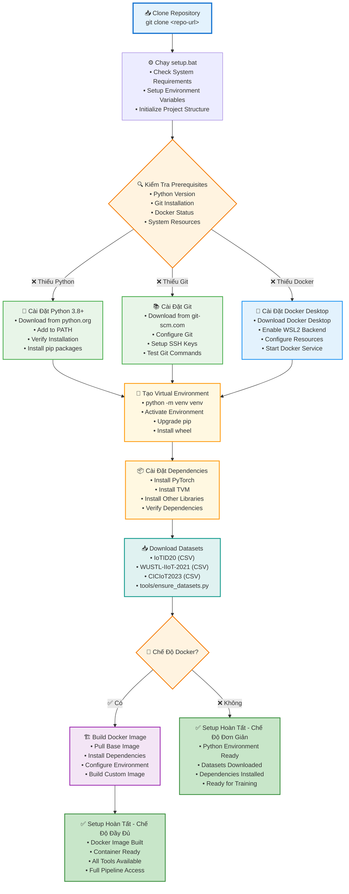

# BitShield_Clone — Document

Tài liệu này tổng hợp đầy đủ cách cài đặt, chạy code, luồng hoạt động, cách huấn luyện, mô phỏng tấn công và cơ chế phòng thủ (DIG/CIG) của dự án BitShield_Clone. Các sơ đồ (flow charts) chi tiết nằm ở phần cuối giúp nắm nhanh pipeline tổng thể.

---

## Mục lục

- [Tổng Quan Dự Án](#tổng-quan-dự-án)
- [Yêu Cầu Hệ Thống](#yêu-cầu-hệ-thống)
- [Cài Đặt](#cài-đặt)
  - [Chế độ đơn giản (không Docker)](#chế-độ-đơn-giản-không-docker)
  - [Chế độ đầy đủ (Docker)](#chế-độ-đầy-đủ-docker)
- [Cấu Trúc Thư Mục](#cấu-trúc-thư-mục)
- [Datasets](#datasets)
- [Huấn Luyện Mô Hình (Training)](#huấn-luyện-mô-hình-training)
- [Đánh Giá & Phòng Thủ (DIG/CIG)](#đánh-giá--phòng-thủ-digcig)
- [Fine-tune DIG (đã tích hợp)](#fine-tune-dig-đã-tích-hợp)
- [Kết Quả & Outputs](#kết-quả--outputs)
- [Troubleshooting](#troubleshooting)
- [Flow Charts Chi Tiết](#flow-charts-chi-tiết)

---

## Tổng Quan Dự Án

BitShield là một dự án nghiên cứu bảo vệ chống lại các cuộc tấn công bit-flip trên các file thực thi mạng nơ-ron sâu (DNN). Dự án cung cấp hai chế độ sử dụng:
- **Chế độ đơn giản**: Không cần Docker, chỉ cần Python và Git
- **Chế độ đầy đủ**: Với Docker để có tất cả tính năng

---

## Yêu Cầu Hệ Thống

- Windows 10/11 hoặc Linux/macOS
- Python 3.8+ (khuyến nghị 3.10/3.11)
- pip / virtualenv (hoặc conda)
- (Tùy chọn) CUDA/cuDNN nếu dùng GPU
- (Tùy chọn) Docker Desktop nếu chạy chế độ đầy đủ

---

## Cài Đặt

### Chế độ đơn giản (không Docker)

```bash
git clone <repo-url>
cd BitShield_Clone

# (Khuyến nghị) tạo virtual env
python -m venv venv
venv\Scripts\activate   # Windows
# source venv/bin/activate   # Linux/macOS

pip install --upgrade pip wheel
pip install -r requirements.txt
```

### Chế độ đầy đủ (Docker)

```bash
# Yêu cầu: Docker Desktop bật và chạy
./docker/setup.sh        # hoặc docker/setup.bat trên Windows
./docker/run-in-docker.sh   # hoặc docker/run-in-docker.bat
```

### Cài đặt TVM (ưu tiên cho Windows/WSL)

> **Lý do:** Pipeline `buildmodels.py` cần TVM để sinh binary `tvm/*.so`, ghi nhận coverage và chèn DIG/CIG. Nếu không có TVM, script chỉ hiển thị cảnh báo và bỏ qua bước build.

**Phương án nhanh (khuyến nghị WSL Ubuntu 22.04):**
- Cài Windows Subsystem for Linux và Ubuntu (`wsl --install -d Ubuntu-22.04`).
- Trong Ubuntu: `sudo apt update && sudo apt install -y git build-essential cmake ninja-build llvm-14-dev libopenblas-dev python3-venv`.
- Tạo environment: `python3 -m venv ~/.venvs/tvm && source ~/.venvs/tvm/bin/activate`.
- Clone TVM: `git clone --recursive https://github.com/apache/tvm.git ~/tvm`.
- Build runtime + python: 
  ```bash
  cd ~/tvm
  mkdir build && cp cmake/config.cmake build/
  sed -i 's/USE_LLVM OFF/USE_LLVM llvm-config-14/' build/config.cmake
  sed -i 's/USE_CUDA OFF/USE_CUDA ON/' build/config.cmake  # nếu có CUDA, bỏ qua nếu không
  cmake -S . -B build -G Ninja
  cmake --build build --parallel
  cmake --install build --prefix ~/.local
  pip install -e python
  ```
- Thiết lập biến môi trường (thêm vào `~/.bashrc`):
  ```bash
  export TVM_HOME=$HOME/tvm
  export PYTHONPATH=$TVM_HOME/python:${PYTHONPATH}
  export PATH=$HOME/.local/bin:${PATH}
  ```

**Phương án thuần Windows (Visual Studio 2022 Build Tools):**
- Cài Visual Studio Build Tools (Desktop development with C++), CMake ≥3.26, Ninja, LLVM 15 (bản prebuilt), Python 3.10/3.11.
- Tạo virtualenv: `python -m venv %USERPROFILE%\venvs\tvm` và `venvs\tvm\Scripts\activate`.
- Clone TVM và mở `x64 Native Tools Command Prompt for VS 2022`:
  ```bat
  git clone --recursive https://github.com/apache/tvm.git %USERPROFILE%\tvm
  cd %USERPROFILE%\tvm
  mkdir build
  copy cmake\config.cmake build\
  ```
- Sửa `build\config.cmake` bật LLVM (`set(USE_LLVM "C:\\Program Files\\LLVM\\bin\\llvm-config.exe")`), tắt CUDA nếu không dùng.
- Build:
  ```bat
  cmake -S . -B build -G "Ninja Multi-Config"
  cmake --build build --config Release
  cmake --install build --config Release --prefix %USERPROFILE%\tvm\dist
  pip install -e python
  ```
- Thiết lập env (PowerShell):
  ```powershell
  $env:TVM_HOME = "$env:USERPROFILE\tvm"
  $env:PYTHONPATH = "$env:TVM_HOME\python;" + $env:PYTHONPATH
  $env:PATH = "$env:USERPROFILE\tvm\dist\bin;" + $env:PATH
  ```

**Kiểm tra:**

```bash
python - <<'PY'
import tvm
from tvm import relay
print("TVM version:", tvm.__version__)
print("LLVM enabled:", tvm.runtime.enabled("llvm"))
PY
```

Nếu lệnh trên in `LLVM enabled: True`, bạn đã sẵn sàng chạy `python buildmodels.py --compiler tvm ...`.

**Khắc phục lỗi `ModuleNotFoundError: No module named 'tvm._ffi'`:**

Lỗi này xảy ra khi TVM C++ library đã được build nhưng Python bindings (`_ffi` module) chưa được build. Module `_ffi` là C extension cần được compile trong quá trình CMake build.

**Giải pháp 1: Rebuild với Python bindings (khuyến nghị)**

```bash
cd ~/tvm

# Xóa build cũ (nếu cần)
# rm -rf build

# Rebuild với Python bindings
mkdir -p build && cd build
cp ../cmake/config.cmake .
# Đảm bảo config.cmake có USE_LLVM được bật
sed -i 's/USE_LLVM OFF/USE_LLVM llvm-config-14/' config.cmake  # hoặc llvm-config-13 tùy version

# Build với Python support
cmake .. -G Ninja
cmake --build . --parallel

# Cài đặt Python package (sau khi CMake build xong)
cd ..
pip install -e python

# Thiết lập environment variables
export TVM_HOME=$HOME/tvm
export PYTHONPATH=$TVM_HOME/python:${PYTHONPATH}
export LD_LIBRARY_PATH=$TVM_HOME/build:$TVM_HOME/build/lib:${LD_LIBRARY_PATH}

# Kiểm tra
python -c "import tvm; print('TVM version:', tvm.__version__)"
```

**Giải pháp 2: Build Python bindings riêng (nếu CMake đã build xong)**

```bash
cd ~/tvm

# Đảm bảo libtvm.so tồn tại
ls -la build/libtvm.so

# Set TVM_LIBRARY_PATH để Python bindings tìm thấy library
export TVM_LIBRARY_PATH=$HOME/tvm/build

# Rebuild Python package với force reinstall
pip install --force-reinstall --verbose -e python

# Thiết lập environment variables
export TVM_HOME=$HOME/tvm
export PYTHONPATH=$TVM_HOME/python:${PYTHONPATH}
export LD_LIBRARY_PATH=$TVM_HOME/build:$TVM_HOME/build/lib:${LD_LIBRARY_PATH}

# Kiểm tra
python -c "import tvm; print('TVM version:', tvm.__version__)"
```

**Giải pháp 3: Kiểm tra và sửa lỗi thường gặp**

Nếu vẫn gặp lỗi:
1. Kiểm tra `libtvm.so` tồn tại: `ls -la ~/tvm/build/libtvm.so`
2. Kiểm tra Python environment: `which python` và `python --version`
3. Xóa cache Python: 
   ```bash
   find ~/tvm/python -name "*.pyc" -delete
   find ~/tvm/python -name "__pycache__" -type d -exec rm -r {} +
   ```
4. Kiểm tra CMake config có bật Python: Trong `build/config.cmake`, đảm bảo không có `set(USE_PYTHON OFF)`
5. Rebuild từ đầu: Xóa `build/` và rebuild lại với các bước ở Giải pháp 1

---

## Cấu Trúc Thư Mục

```
BitShield_Clone/
├─ support/
│  ├─ models/                 # Kiến trúc mô hình & training helpers
│  ├─ dataset/                # Dữ liệu tabular (IoTID20/WUSTL/CICIoT2023)
│  ├─ torchdig_tabular.py     # DIG cho tabular (đã được cải thiện)
│  └─ ...
├─ attack_with_defense_extended.py  # Mô phỏng tấn công + DIG/CIG (mở rộng)
├─ attack_with_defense_updated.py   # Phiên bản cũ (IoTID20 focus)
├─ train_all_models.py        # Train tất cả model × dataset
├─ train_dataset_models.py    # Train tất cả model cho một dataset
├─ train_all.bat              # Menu chạy nhanh trên Windows
├─ results/                   # Thư mục lưu kết quả
└─ FLOWCHARTS_DETAILED.md     # (File này) README + Flow Charts
```

---

## Datasets

Các dataset tabular đã hỗ trợ:

- IoTID20
- WUSTL-IIoT-2021
- CICIoT2023

Bạn có thể đặt dữ liệu vào `support/dataset/<DatasetName>/...` theo đúng tên thư mục, hoặc dùng script có sẵn để đảm bảo dữ liệu:

```bash
python tools/ensure_datasets.py
```

---

## Huấn Luyện Mô Hình (Training)

### Train tất cả model × tất cả dataset

```bash
python train_all_models.py
```

### Train nhanh (ít epoch) để smoke-test

Sử dụng số epoch nhỏ khi gọi các lệnh training phía trên, ví dụ `--epochs 1` để smoke-test nhanh.

### Train tất cả model trên một dataset cụ thể

```bash
python train_dataset_models.py IoTID20 --epochs 10 --batch-size 256 --device cpu
python train_dataset_models.py WUSTL    --epochs 10 --batch-size 256 --device cpu
python train_dataset_models.py CICIoT2023 --epochs 10 --batch-size 256 --device cpu
```

### Train trực tiếp bằng `train_extended.py`

```bash
# Training ResNetSEBlockIoT trên WUSTL
python support/models/train_extended.py ResNetSEBlockIoT WUSTL --epochs 10 --use-class-weights --device cpu

# Training SimpleCNNIoT trên CICIoT2023 với class weights
python support/models/train_extended.py SimpleCNNIoT CICIoT2023 --epochs 15 --use-class-weights --device cpu

# Training IoTID20 với tuỳ chọn nâng cao
python support/models/train_extended.py ResNetSEBlockIoT IoTID20 --epochs 20 --batch-size 128 --use-class-weights --learning-rate 0.001 --weight-decay 0.0001 --device cpu
```

### Windows .bat (menu)

```bat
train_all.bat
```


```

### Tuỳ chọn training

| Parameter | Mô tả | Default |
|-----------|-------|---------|
| `--epochs` | Số epochs | 10 |
| `--batch-size` | Batch size | 256 |
| `--device` | Device (cpu/cuda) | cpu |
| `--use-class-weights` | Sử dụng class weights | False |
| `--learning-rate` | Learning rate | 1e-3 |
| `--weight-decay` | Weight decay | 1e-4 |

---

## Đánh Giá & Phòng Thủ (DIG/CIG)

Script chính: `attack_with_defense_extended.py` (hỗ trợ IoTID20, WUSTL, CICIoT2023)

### Chạy DIG

```bash
python attack_with_defense_extended.py dig ResNetSEBlockIoT IoTID20 --device cpu
```

### Chạy CIG

```bash
python attack_with_defense_extended.py cig ResNetSEBlockIoT IoTID20 --device cpu
```

### Kết hợp (DIG + CIG)

```bash
python attack_with_defense_extended.py combined ResNetSEBlockIoT IoTID20 --device cpu
```

Kết quả sẽ được lưu ở `results/defense_results/` dưới dạng JSON.

Gợi ý: `attack_with_defense_extended.py` đã tích hợp:
- Dynamic threshold theo sức mạnh tấn công cho DIG
- Không bỏ qua mẫu khi phát hiện (tính accuracy công bằng)
- Khôi phục tham số mô hình sau mỗi lượt tấn công
- Fallback cho ultra-extreme (≥ 10.0)

---

## Fine-tune DIG (đã tích hợp)

Chúng tôi đã cải thiện DIG cho dữ liệu tabular trong `support/torchdig_tabular.py` và logic mô phỏng trong `attack_with_defense_extended.py`:

- Đồng bộ device cho mọi tensor (tránh lỗi cuda/cpu mismatch)
- Không skip samples khi detect (đánh giá accuracy công bằng như CIG)
- Dynamic threshold theo sức mạnh tấn công (0.5×/0.8×/1.0×/1.1×)
- Fallback detection cho ultra-extreme attacks (≥ 10.0)
- Attack simulation dùng noise tương đối (tỉ lệ theo std tham số)
- Model restoration an toàn sau mỗi lượt tấn công (hoặc reload từ file)
- Tính detection-rate theo số lượng **samples** (không phải batch)

Chi tiết tính năng DIG (tabular):
- Adaptive thresholds từ clean data (percentile 10–90)
- Dynamic multiplier theo strength: yếu → 1.1×, vừa → 1.0×, mạnh → 0.8×, 5.0+ → 0.4×, 10.0+ → 0.2×
- Kết hợp nhiều tín hiệu: gradient norm, feature z-score, entropy anomaly, confidence anomaly

Ví dụ kết quả kỳ vọng (IoTID20, ResNetSEBlockIoT):

- Strength 0.5–1.0: Accuracy drop thấp, detection thấp (realistic)
- Strength 2.0: Accuracy drop 25–30%, detection ~100% (balance)
- Strength 5.0: Accuracy drop mạnh, detection ~100%
- Strength 10.0: Accuracy drop rất mạnh, detection 100% (fallback nếu cần)

---

## Kết Quả & Outputs

- Models: `models/<Dataset>/<Model>/<Model>.pt` và `<Model>_best.pt`
- Training results: `models/<Dataset>/<Model>/<Model>_results.json`
- Defense results (DIG/CIG): `results/defense_results/<Dataset>_<Model>_*.json`

---

## Troubleshooting

- PyTorch CUDA: Nếu không có CUDA, dùng `--device cpu`.
- Lỗi device mismatch (cuda/cpu): đã xử lý trong `support/torchdig_tabular.py`; đảm bảo mọi tensor/model cùng `--device` (cpu/cuda).
- DIG detection rate = 0% cho attack nhẹ: bình thường (dynamic threshold tăng để giảm false-positive).
- DIG detection rate = 100% cho attack 10.0: do fallback cho ultra-extreme; kiểm tra log threshold/multiplier.
- Nếu model hỏng sau attack: script sẽ restore từ tham số gốc hoặc reload từ file.

---

## 1. Flow Chart Tổng Quan Dự Án - Chi Tiết

```mermaid
graph TD
    A["🚀 Start: Clone Repository<br/>git clone BitShield_Clone"] --> B{"🎯 Chọn Chế Độ Sử Dụng"}
    
    B -->|"📦 Đơn Giản"| C["🐍 Setup Python Environment<br/>• Python 3.8+<br/>• Virtual Environment<br/>• Install Dependencies"]
    B -->|"🐳 Đầy Đủ"| D["🐳 Setup Docker Environment<br/>• Docker Desktop<br/>• Build Docker Image<br/>• Configure Container"]
    
    C --> E["📥 Download Datasets<br/>• IoTID20, WUSTL-IIoT-2021<br/>• CICIoT2023<br/>• Auto-download & Setup"]
    D --> E
    
    E --> F["🎓 Train Models<br/>• Load Model Architecture<br/>• Setup Data Loaders<br/>• Training Loop<br/>• Save Checkpoints"]
    F --> G["🧪 Test Models<br/>• Load Trained Model<br/>• Evaluate on Test Set<br/>• Accuracy/TPR/F1/MCC<br/>• Generate Reports"]
    
    G --> H{"🔍 Chế Độ Đầy Đủ?"}
    H -->|"❌ Không"| I["✅ Kết Thúc - Chế Độ Đơn Giản<br/>• Models Trained<br/>• Basic Testing Done<br/>• Ready for Deployment"]
    H -->|"✅ Có"| J["🔨 Build Binary Files<br/>• Convert PyTorch to IR<br/>• TVM/Glow/NNFusion Compilation<br/>• Add Protection Mechanisms"]
    
    J --> K["🔍 (Tùy chọn) Phân tích sweep bit-flip<br/>• Áp dụng nếu dùng pipeline nhị phân
• Tạo điểm yếu tiềm năng
• Lưu kết quả"]
    K --> L["⚔️ Mô phỏng tấn công (DIG/CIG)
• Nhiễu tham số theo độ mạnh
• DIG: dynamic thresholds, multi-signal
• Đánh giá detection & accuracy
• Lưu kết quả"]
    L --> M["🔬 Ghidra Analysis<br/>• Import Binary Files<br/>• Static Code Analysis<br/>• Extract Instructions<br/>• Generate Reports"]
    M --> N["📊 Generate Results<br/>• Compile Analysis Data<br/>• Create Visualizations<br/>• Generate Reports<br/>• Export Results"]
    N --> O["🏆 Kết Thúc - Chế Độ Đầy Đủ<br/>• Complete Security Analysis<br/>• Protection Evaluation<br/>• Research Results Ready"]
    
    style A fill:#e3f2fd,stroke:#1976d2,stroke-width:3px
    style I fill:#c8e6c9,stroke:#388e3c,stroke-width:2px
    style O fill:#c8e6c9,stroke:#388e3c,stroke-width:2px
    style B fill:#fff3e0,stroke:#f57c00,stroke-width:2px
    style H fill:#fff3e0,stroke:#f57c00,stroke-width:2px
    style C fill:#e8f5e8,stroke:#4caf50,stroke-width:2px
    style D fill:#e3f2fd,stroke:#2196f3,stroke-width:2px
    style F fill:#fff8e1,stroke:#ff9800,stroke-width:2px
    style G fill:#fff8e1,stroke:#ff9800,stroke-width:2px
    style J fill:#f3e5f5,stroke:#9c27b0,stroke-width:2px
    style K fill:#e0f2f1,stroke:#009688,stroke-width:2px
    style L fill:#ffebee,stroke:#f44336,stroke-width:2px
    style M fill:#e8eaf6,stroke:#3f51b5,stroke-width:2px
    style N fill:#f1f8e9,stroke:#8bc34a,stroke-width:2px
```



---

## 2. Flow Chart Cài Đặt và Setup - Chi Tiết



---

## 3. Flow Chart Huấn Luyện Mô Hình - Chi Tiết

```mermaid
graph TD
    A["🎓 Start Training Process<br/>• Select Model Architecture<br/>• Choose Dataset<br/>• Set Hyperparameters"] --> B["📋 Chọn Model & Dataset<br/>• Model: ResNetSEBlockIoT/SimpleCNNIoT/EfficientCNN/PureCNN/Custom
• Dataset: IoTID20/WUSTL-IIoT-2021/CICIoT2023
• Input Size: số features tabular"]
    
    B --> C{"🏗️ Model Type"}
    C -->|"⚙️ Tabular Models"| E["🔨 Load IoT Tabular Model<br/>• Import from support.models
• Initialize with input_size & num_classes
• Setup Optimizer/Loss"]
    
    D --> F["📊 Setup Data Loaders<br/>• Create Dataset Objects<br/>• Apply Transforms<br/>• Setup Batch Size<br/>• Configure Workers"]
    E --> F
    
    F --> G["⚙️ Initialize Optimizer & Loss<br/>• Adam/AdamW Optimizer<br/>• Learning Rate Setup<br/>• CrossEntropy/Focal Loss (tùy dataset)
• LR Scheduler"]
    G --> H["🔄 Training Loop<br/>• Set Number of Epochs<br/>• Setup Progress Tracking<br/>• Initialize Metrics<br/>• Start Training"]
    
    H --> I["➡️ Forward Pass<br/>• Load Batch Data<br/>• Move to Device<br/>• Model Forward Pass<br/>• Get Predictions"]
    I --> J["📉 Calculate Loss<br/>• Compare Predictions vs Labels<br/>• Compute Loss Value<br/>• Track Loss History<br/>• Log Training Progress"]
    J --> K["⬅️ Backward Pass<br/>• Compute Gradients<br/>• Gradient Clipping<br/>• Update Model Parameters<br/>• Clear Gradients"]
    K --> L["🔄 Update Parameters<br/>• Apply Optimizer Step<br/>• Update Learning Rate<br/>• Track Parameter Changes<br/>• Save Checkpoints"]
    
    L --> M{"📅 End of Epoch?"}
    M -->|"❌ Không"| I
    M -->|"✅ Có"| N["🧪 Validation<br/>• Switch to Eval Mode<br/>• Run on Validation Set<br/>• Calculate Metrics<br/>• Compare with Best"]
    
    N --> O{"📊 Accuracy OK?"}
    O -->|"❌ Không"| P{"⏰ Max Epochs?"}
    O -->|"✅ Có"| Q["💾 Save Model<br/>• Save Best Weights<br/>• Save Training History<br/>• Save Configuration<br/>• Update Model Registry"]
    
    P -->|"❌ Không"| H
    P -->|"✅ Có"| Q
    
    Q --> R["🎉 Training Complete<br/>• Model Saved Successfully<br/>• Training Metrics Logged<br/>• Ready for Testing<br/>• Next: Model Evaluation"]
    
    style A fill:#e3f2fd,stroke:#1976d2,stroke-width:3px
    style R fill:#c8e6c9,stroke:#388e3c,stroke-width:2px
    style C fill:#fff3e0,stroke:#f57c00,stroke-width:2px
    style M fill:#fff3e0,stroke:#f57c00,stroke-width:2px
    style O fill:#fff3e0,stroke:#f57c00,stroke-width:2px
    style P fill:#fff3e0,stroke:#f57c00,stroke-width:2px
    style D fill:#e8f5e8,stroke:#4caf50,stroke-width:2px
    style E fill:#f3e5f5,stroke:#9c27b0,stroke-width:2px
    style F fill:#fff8e1,stroke:#ff9800,stroke-width:2px
    style G fill:#fff8e1,stroke:#ff9800,stroke-width:2px
    style H fill:#e0f2f1,stroke:#009688,stroke-width:2px
    style I fill:#e0f2f1,stroke:#009688,stroke-width:2px
    style J fill:#e0f2f1,stroke:#009688,stroke-width:2px
    style K fill:#e0f2f1,stroke:#009688,stroke-width:2px
    style L fill:#e0f2f1,stroke:#009688,stroke-width:2px
    style N fill:#fff8e1,stroke:#ff9800,stroke-width:2px
    style Q fill:#f1f8e9,stroke:#8bc34a,stroke-width:2px
```



---

## 4. Flow Chart Build Binary Files - Chi Tiết

```mermaid
graph TD
    A["🔨 Start Build Process<br/>• Load Trained Model<br/>• Setup Build Environment<br/>• Configure Compiler"] --> B["📦 Load Trained Model<br/>• Load PyTorch Model<br/>• Extract Model Parameters<br/>• Convert to ONNX Format<br/>• Validate Model Structure"]
    B --> C["🔄 Convert to IR Module<br/>• Parse Model Graph<br/>• Create Intermediate Representation<br/>• Optimize Graph Structure<br/>• Prepare for Compilation"]
    
    C --> D{"🔧 Compiler Type"}
    D -->|"📺 TVM"| E["📺 TVM Compilation<br/>• Load TVM Runtime<br/>• Compile with TVM<br/>• Optimize for Target<br/>• Generate TVM IR"]
    D -->|"💡 Glow"| F["💡 Glow Compilation<br/>• Load Glow Backend<br/>• Compile with Glow<br/>• Optimize for CPU<br/>• Generate Glow IR"]
    D -->|"⚡ NNFusion"| G["⚡ NNFusion Compilation<br/>• Load NNFusion<br/>• Compile with NNFusion<br/>• Optimize for GPU<br/>• Generate NNFusion IR"]
    
    E --> H["🔧 Instrument Module<br/>• Add Coverage Tracking<br/>• Insert Debug Points<br/>• Add Performance Monitoring<br/>• Setup Logging"]
    F --> H
    G --> H
    
    H --> I["📊 Add Coverage Tracking<br/>• Setup Coverage Metrics<br/>• Add Coverage Hooks<br/>• Configure Coverage Collection<br/>• Initialize Coverage Data"]
    I --> J["🛡️ Add DIG Protection<br/>• Insert Integrity Checks<br/>• Add Detection Logic<br/>• Setup Alert Mechanisms<br/>• Configure DIG Parameters"]
    J --> K["🔒 Add CIG Protection<br/>• Add Code Integrity Guards<br/>• Insert Checksum Calculations<br/>• Setup Verification Points<br/>• Configure CIG Settings"]
    
    K --> L["🏗️ Build Binary<br/>• Compile to Object Code<br/>• Link Dependencies<br/>• Generate Executable<br/>• Optimize Binary Size"]
    L --> M["💾 Save Binary File<br/>• Write to Disk<br/>• Set Permissions<br/>• Verify File Integrity<br/>• Update File Registry"]
    M --> N["📋 Generate Output Definitions<br/>• Create Output Schema<br/>• Define Data Types<br/>• Setup Output Format<br/>• Save Definitions"]
    
    N --> O["🧪 Check Accuracy<br/>• Load Test Dataset<br/>• Run Binary Inference<br/>• Compare with Original<br/>• Calculate Accuracy Metrics"]
    O --> P{"📊 Accuracy > 0.6?"}
    P -->|"❌ Không"| Q["❌ Build Failed<br/>• Log Error Details<br/>• Rollback Changes<br/>• Notify User<br/>• Suggest Fixes"]
    P -->|"✅ Có"| R["✅ Build Success<br/>• Binary Ready<br/>• Protection Active<br/>• Ready for Testing<br/>• Next: Security Analysis"]
    
    style A fill:#e3f2fd,stroke:#1976d2,stroke-width:3px
    style Q fill:#ffcdd2,stroke:#f44336,stroke-width:2px
    style R fill:#c8e6c9,stroke:#388e3c,stroke-width:2px
    style D fill:#fff3e0,stroke:#f57c00,stroke-width:2px
    style P fill:#fff3e0,stroke:#f57c00,stroke-width:2px
    style E fill:#e3f2fd,stroke:#2196f3,stroke-width:2px
    style F fill:#e8f5e8,stroke:#4caf50,stroke-width:2px
    style G fill:#f3e5f5,stroke:#9c27b0,stroke-width:2px
    style H fill:#fff8e1,stroke:#ff9800,stroke-width:2px
    style I fill:#e0f2f1,stroke:#009688,stroke-width:2px
    style J fill:#ffebee,stroke:#f44336,stroke-width:2px
    style K fill:#e8eaf6,stroke:#3f51b5,stroke-width:2px
    style L fill:#f1f8e9,stroke:#8bc34a,stroke-width:2px
    style M fill:#f1f8e9,stroke:#8bc34a,stroke-width:2px
    style N fill:#fff8e1,stroke:#ff9800,stroke-width:2px
    style O fill:#e0f2f1,stroke:#009688,stroke-width:2px
```



---

## 5. Flow Chart Bit-Flip Sweep Analysis - Chi Tiết

```mermaid
graph TD
    A["🔍 Start Bit-Flip Sweep<br/>• Initialize Analysis Environment<br/>• Setup Progress Tracking<br/>• Configure Analysis Parameters"] --> B["📦 Load Binary File<br/>• Load Compiled Binary<br/>• Parse Binary Structure<br/>• Extract Code Sections<br/>• Setup Memory Mapping"]
    B --> C["📊 Load Test Dataset<br/>• Load Validation Data<br/>• Setup Data Iterators<br/>• Configure Batch Processing<br/>• Initialize Metrics Collection"]
    
    C --> D["🗄️ Initialize Results Storage<br/>• Create Results Database<br/>• Setup Data Structures<br/>• Initialize Metrics Arrays<br/>• Configure Storage Format"]
    D --> E["ℹ️ Get Binary Info<br/>• Extract Binary Metadata<br/>• Get File Size<br/>• Calculate Total Bits<br/>• Setup Bit Indexing"]
    
    E --> F["🧮 Calculate Total Bits<br/>• Count All Bits in Binary<br/>• Setup Bit Position Mapping<br/>• Calculate Analysis Scope<br/>• Estimate Processing Time"]
    F --> G["📈 Setup Progress Tracking<br/>• Initialize Progress Bar<br/>• Setup Time Estimation<br/>• Configure Logging<br/>• Setup Checkpoint System"]
    
    G --> H["🔄 For Each Bit Position<br/>• Iterate Through All Bits<br/>• Select Target Bit<br/>• Prepare Bit Flip<br/>• Setup Analysis Context"]
    H --> I["🔄 Flip Bit<br/>• Read Original Bit Value<br/>• Calculate New Bit Value<br/>• Apply Bit Flip<br/>• Verify Flip Success"]
    I --> J["🚀 Run Inference<br/>• Load Test Input<br/>• Execute Binary<br/>• Capture Output<br/>• Measure Execution Time"]
    
    J --> K["📊 Calculate Metrics<br/>• Compare Outputs<br/>• Calculate Accuracy Change<br/>• Measure Performance Impact<br/>• Analyze Behavioral Changes"]
    K --> L["📉 Accuracy Change<br/>• Calculate Original Accuracy<br/>• Calculate New Accuracy<br/>• Compute Accuracy Delta<br/>• Store Accuracy Metrics"]
    L --> M["🏷️ Top Label Change<br/>• Extract Top Predictions<br/>• Compare Label Changes<br/>• Calculate Label Shift<br/>• Store Label Metrics"]
    M --> N["🎨 LPIPS Score<br/>• Calculate Perceptual Similarity<br/>• Compare Output Images<br/>• Compute LPIPS Distance<br/>• Store Visual Metrics"]
    N --> O["📏 FID Score<br/>• Calculate Feature Distance<br/>• Compare Feature Distributions<br/>• Compute FID Score<br/>• Store Quality Metrics"]
    
    O --> P["🎯 Calculate Suspicious Score<br/>• Combine All Metrics<br/>• Apply Weighting Scheme<br/>• Calculate Final Score<br/>• Store Suspicious Score"]
    P --> Q["💾 Store Results<br/>• Save Bit Position<br/>• Store All Metrics<br/>• Update Progress<br/>• Write to Database"]
    
    Q --> R{"🔄 More Bits?"}
    R -->|"✅ Có"| H
    R -->|"❌ Không"| S["💾 Save Sweep Results<br/>• Compile All Results<br/>• Create Summary Statistics<br/>• Generate Analysis Report<br/>• Export Data Files"]
    
    S --> T["📋 Generate Analysis Report<br/>• Create Visualizations<br/>• Generate Statistics<br/>• Identify Vulnerable Bits<br/>• Create Recommendations"]
    T --> U["✅ Sweep Complete<br/>• Analysis Finished<br/>• Results Available<br/>• Ready for Attack Simulation<br/>• Next: Security Evaluation"]
    
    style A fill:#e3f2fd,stroke:#1976d2,stroke-width:3px
    style U fill:#c8e6c9,stroke:#388e3c,stroke-width:2px
    style H fill:#fff3e0,stroke:#f57c00,stroke-width:2px
    style R fill:#fff3e0,stroke:#f57c00,stroke-width:2px
    style B fill:#e8f5e8,stroke:#4caf50,stroke-width:2px
    style C fill:#fff8e1,stroke:#ff9800,stroke-width:2px
    style D fill:#e0f2f1,stroke:#009688,stroke-width:2px
    style E fill:#e0f2f1,stroke:#009688,stroke-width:2px
    style F fill:#e0f2f1,stroke:#009688,stroke-width:2px
    style G fill:#fff8e1,stroke:#ff9800,stroke-width:2px
    style I fill:#f3e5f5,stroke:#9c27b0,stroke-width:2px
    style J fill:#e8eaf6,stroke:#3f51b5,stroke-width:2px
    style K fill:#fff8e1,stroke:#ff9800,stroke-width:2px
    style L fill:#e0f2f1,stroke:#009688,stroke-width:2px
    style M fill:#e0f2f1,stroke:#009688,stroke-width:2px
    style N fill:#fff8e1,stroke:#ff9800,stroke-width:2px
    style O fill:#e0f2f1,stroke:#009688,stroke-width:2px
    style P fill:#f1f8e9,stroke:#8bc34a,stroke-width:2px
    style Q fill:#f1f8e9,stroke:#8bc34a,stroke-width:2px
    style S fill:#f1f8e9,stroke:#8bc34a,stroke-width:2px
    style T fill:#fff8e1,stroke:#ff9800,stroke-width:2px
```



---

## Tóm Tắt Các Thành Phần Chính

### 1. **Core Components**
- **Training Module**: Huấn luyện các mô hình DNN với PyTorch
- **Build Module**: Chuyển đổi mô hình thành binary files với TVM/Glow/NNFusion
- **Sweep Module**: Phân tích bit-flip vulnerabilities chi tiết
- **Attack Module**: Mô phỏng tấn công thực tế
- **(Tùy chọn) Build/Sweep/Analysis**: Dùng khi chạy pipeline nhị phân (TVM/Glow/NNFusion/Ghidra)

### 2. **Protection Mechanisms**
- **DIG (Detection of Integrity Guard)**: Phát hiện thay đổi integrity
- **CIG (Coverage Integrity Guard)**: Theo dõi coverage để phát hiện anomalies

### 3. **Supported Models**
- ResNetSEBlockIoT, SimpleCNNIoT, EfficientCNN, PureCNN, CustomModel, CustomModel2
- Datasets: IoTID20, WUSTL-IIoT-2021, CICIoT2023

### 4. **Compilers**
- TVM, Glow, NNFusion

### 5. **Workflow Modes**
- **Simple Mode**: Chỉ training và testing
- **Full Mode**: Toàn bộ pipeline từ training đến attack simulation

Các flow chart này cung cấp cái nhìn tổng quan chi tiết về cách dự án BitShield hoạt động, với thông tin chi tiết về từng bước trong quy trình.
